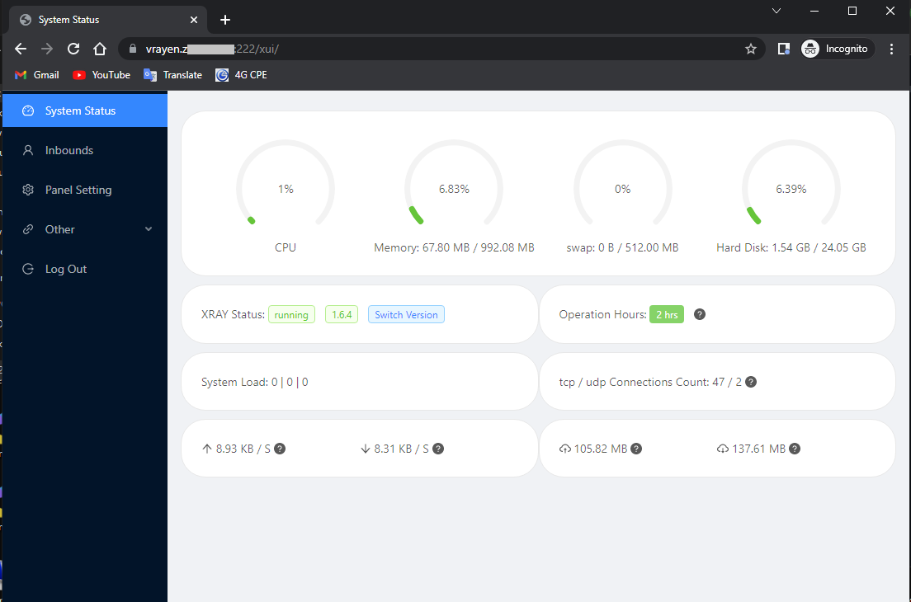
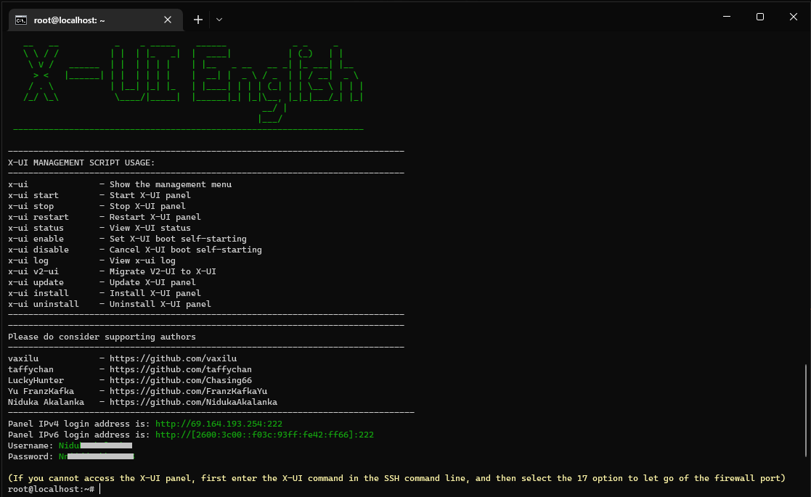
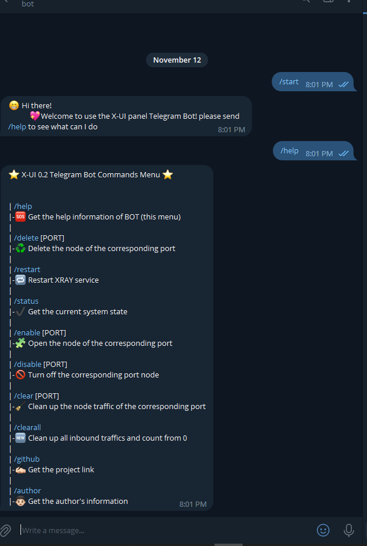
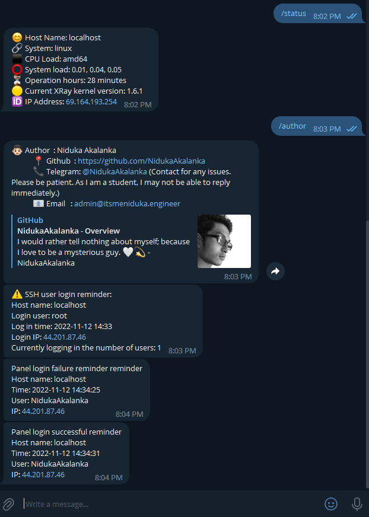
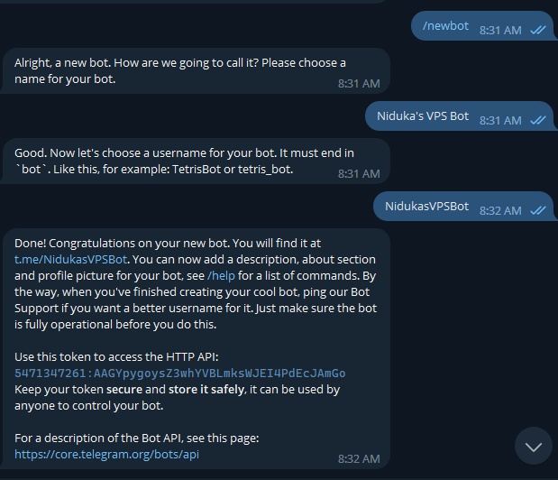
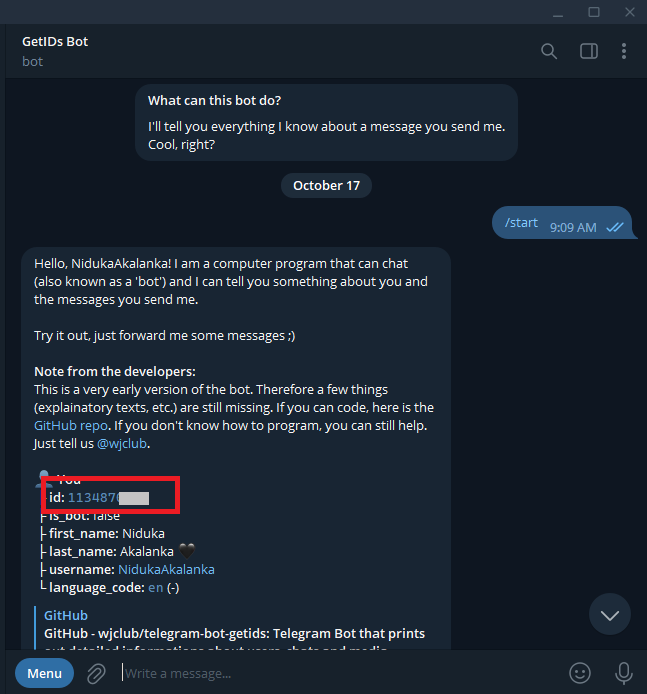

[](https://github.com/NidukaAkalanka/x-ui-english/)
[](https://github.com/NidukaAkalanka/x-ui-english/)
[](https://github.com/NidukaAkalanka/x-ui-english/)
[](https://github.com/NidukaAkalanka/x-ui-english/)
[](https://github.com/NidukaAkalanka/x-ui-english/)
[](https://github.com/NidukaAkalanka/x-ui-english/)

# X-UI ENGLISH VERSION 
[For X-UI FARSI VERSION](README-fa.md)

Another Translated-to-English Version of X-UI; with some of more advanced features implemented. 
 
A furthur development from [my previous repo](https://github.com/NidukaAkalanka/x-ui-english.old) and
kind a fork from [taffychan's x-ui](https://github.com/taffychan/x-ui) + [hossinasaadi's x-ui](https://github.com/hossinasaadi/x-ui), which all are forked from [vaxilu's awesome project](https://github.com/vaxilu/x-ui/) : a Multi-protocol Multi-user Xray Panel

# Features

- Everything is in English (Serverside setup + Serverside UI + Web UI)
- System status monitoring
- Support multi-user multi-protocol, web page visualization operation
- Multi UUIDs can be added as users for Vmess and Vless configurations with separate QR codes
- IP limitation
- Supported protocols: vmess, vless, trojan, shadowsocks, dokodemo-door, socks, http
- Support to configure more transmission configurations
- Traffic statistics, limit traffic, limit expiration time
- Customizable xray configuration templates
- Support https access panel (bring your own domain name + ssl certificate)
- Telegram Bot for basic functions and noticifactions
- Support one-click SSL certificate application and automatic renewal
- Can be securely migrated from v2-ui 
- Can be securely updated from a previous X-UI (CH/EN) version without lossing outbounds
- For more advanced configuration items, see the panel for details


# Preview


# Telegram Bot Preview (Currently, only for V0.2)


# Single Command Install & upgrade

````
bash <(curl -Ls https://raw.githubusercontent.com/NidukaAkalanka/x-ui-english/master/install.sh)
````

## Manual install & upgrade

1. First update your system and run the following commands. (Must have root user permissions)
```` 
sudo su
cd
````
2. Then download the latest compressed package from /releases/latest, generally choose `amd64` architecture
3. Run the following commands respectively:

> If your server cpu architecture is not `amd64`, replace `*` in the command with another architecture

````
rm x-ui/ /usr/local/x-ui/ /usr/bin/x-ui -rf
tar zxvf x-ui-linux-amd64.tar.gz
chmod +x x-ui/x-ui x-ui/bin/xray-linux-* x-ui/x-ui.sh
cp x-ui/x-ui.sh /usr/bin/x-ui
cp -f x-ui/x-ui.service /etc/systemd/system/
mv x-ui/ /usr/local/
systemctl daemon-reload
systemctl enable x-ui
systemctl restart x-ui
````

## Install using docker


1. Install docker

```shell
curl -fsSL https://get.docker.com | sh
````

2. Install x-ui

```shell
mkdir x-ui && cd x-ui
docker run -itd --network=host \
    -v $PWD/db/:/etc/x-ui/ \
    -v $PWD/cert/:/root/cert/ \
    --name x-ui --restart=unless-stopped \
    enwaiax/x-ui:latest
````

> Build your own image

```shell
docker build -t x-ui .
````

## SSL certificate application

The script has 3 built-in SSL certificate application functions. Using a sub-domain is recommended.
- ### 1st Method (Recommended. Works for almost any TLD including Freenom free TLDs)
To use this method to apply for a certificate, your server's IP addres being correctly pointed to a domain or subdomain that you own is the only requirement. (Acme.sh script's 3rd option)

- ### 2nd and 3rd Methods (Use if the above one fails. Would not work for Freenom free TLDs)
This is not beginner frienly as much as the first one. To use this method, all of the follwoing prerequisites should be met:
- Knowing the Cloudflare registered email address
- Knowing the Cloudflare Global API Key
- Having domain name has been resolved to the current server through cloudflare

How to get the Cloudflare Global API Key:
1. Visit the link https://dash.cloudflare.com/profile/api-tokens
2. Click on View Global API Key (See the screenshot below)
        
3. You may have to re-authenticate your account. After that, the API Key will be shown (See the screenshot below)\
        

When using, just enter `domain name`, `email`, `API KEY`, the diagram is as follows:
        

Precautions:

- The script uses DNS API for certificate request
- Use Let'sEncrypt as the CA party by default. You can choose between Zerossl.com or Buypass.com
- The certificate installation directory is the /root/ directory
- The certificates applied for by this script are all generic domain name certificates

## IP Limitation and Multi-User on Same Port
There is almost nothing to explain abount Multi-User thing. You will have separate QR codes along with traffic calculation, expiry date setting and stuff. 

**The IP limitation woks as follows:**

**Occasion:**
- There's a client who is using a v2ray config with IP limitation = 1. 
- He is currently connected to the v2ray server from his PC with Wi-Fi 
- Then he is trying connect to the server using the same v2ray config from his mobile with 4G **AT THE SAME TIME** 

**Outcome :**
- There's no impact to his PC's connection
- On his mobile, he will be succesfully connected for about 10 seconds
- Then, his mobile's internet connection through v2ray will be stopped. Returning **ERR_CONNECTION_CLOSED**. 

**Occasion:**
- Afetr some time, the same client, mentioned above, disonnects his PC from v2ray
- But keeps his mobile trying to connect

**Outcome:**
- After about 10 seconds past disconnecting the PC, he will regain the connection for his mobile.

**If it is a fresh installation, these functions, specially IP limiting, will work flowlessly. But if yours is an upgrading, they miight not work while giving XRAY status : not running. In such cases, please refer [here](https://github.com/NidukaAkalanka/x-ui-english/discussions/27)**

## Suggested OSs

- CentOS 7+
- Ubuntu 16+
- Debian 8+

## Telegram Bot Setup Guie (Currently, only for V0.2)
X-UI English supports daily traffic notification, panel and sercer login reminder and other functions through Telegram bot.

**Bot Fuctions**
- Inbounds traffic usage
- Panel login reminder
- Server SSH login reminder
- Inbounds expiration alert
- Traffic warning reminder
- Daily summery at a pre-defined time
And more to come.....

Follow these steps correclty to activate X-UI English Telegram Bot:
1. Head to [Botfather bot](https://t.me/BotFather). Start it and send /newbot command. Follow the Bot's instruvtions for setting a name and username for your bot. Upon a successful new bot creation, you'll see a message like follows. which contains your API key. Keep it somewhere safer. You'll need it later.



2. Then, start [GetUIDs Bot](https://t.me/getidsbot) and send it a message. Copy the number under "You". See the following screenshot.



3. Finally, Paste UID and API Key in the correct text boxes on the X-UI English web panel's Telegram Bot Settings tab; after enabling the bot. Access https://t.me/ `Your Bot Userame`. Use it's instructions to go ahead and use the commands.

### Telegram Bot Timing Format (Crontab Guuide) 

Reference Syntax:
- `*/30 * * * *` Notift every 30 minutes, every hour
- `30 * * * * *` Notify at the 30s of each point
- `@hourly`      hourly notifications
- `@daily`       Daily notification (00:00 AM)
- `@every 8h`    Notification every 8 hours

More details about Crontab [here](https://support-acquia.force.com/s/article/360004224494-Cron-time-string-format)
## Note for Beginner Devs
Hey Beginner Developer! Appreciate your intrest on playing the codes with this repository. I have seen many people who are not much familiar with none of the languages used here, but still need to do some modifications such as translating the UIs to their native language, modifying telegram bot functions and etc... But after they are done with all of these code modifications, some of them having hard times converting their code into a binary. So they contact me and I have to repeatedly tell them the same procedure. So, here's how you can do it by yourself.
- Head to `Your fork repository link`/actions . Enable Github Actions if it isn't yet.
- Click on Relese X-ui under All workflows
- Finally, click Run workflow twice. Wait untill the workflow run finishes. Once finished, you will find a release packages with your modifications at `Your fork repository link`/releases
 
If you are looking to modify Telegram Bot functions, the Bot's code lives at `/web/service/telegram.go`

**Happy Coding, Beginner Dev!** 

## Issues Fixed until the latest update

### Fixed on 0.1 --
- GLIBC 2.28 Not Found error
- Workflow error due to TG Bot 
- One-click SSL installation 
### Fixed on 0.2 --
- Multi-user IDs for Vmess and Vless 
- Lack of Telegram bot implementation 
- Release packages being much heavier in size 
- Download traffic not being monitored
### Fixed on 0.2.1 --
- Download data not being calculated
- Lack of separate QR codes for each multi-users on VMess/Vless
- Operation hours not being translated to English 
- IP limitation not being worked
- Minor bugs with Docker installation 
### Fixed on 0.2.1.1 --
- Error while swithcing Xray version
### Fixed on 0.2.1.2 --
- ip.gs error causing IP scraping errors
