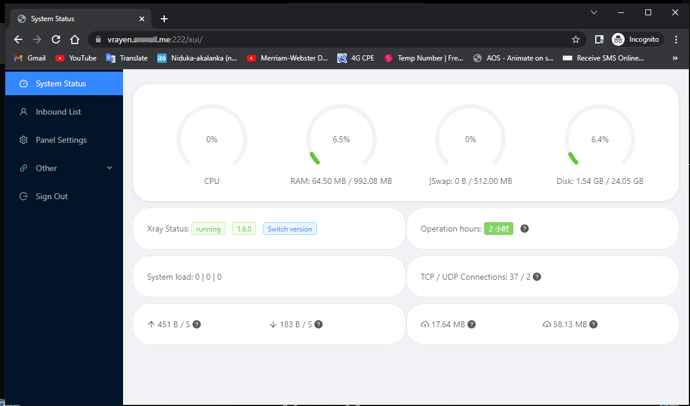
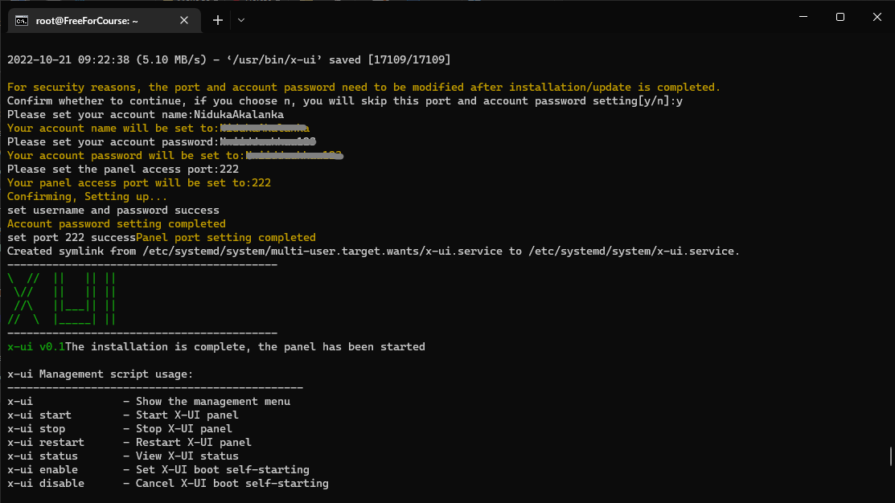

# X-UI ENGLISH VERSION

The Translated-to-English Version of [Yu FranzKafka's x-ui](https://github.com/vaxilu/x-ui), forked from [vaxilu's awesome repo](https://github.com/vaxilu/x-ui/) which is a Multi-protocol Multi-user Xray Panel

# Features

- Everything is in English (Serverside setup + Serverside UI + Web UI)
- System status monitoring
- Support multi-user multi-protocol, web page visualization operation
- Supported protocols: vmess, vless, trojan, shadowsocks, dokodemo-door, socks, http
- Support to configure more transmission configurations
- Traffic statistics, limit traffic, limit expiration time
- Customizable xray configuration templates
- Support https access panel (bring your own domain name + ssl certificate)
- Support one-click SSL certificate application and automatic renewal
- For more advanced configuration items, see the panel for details

# Preview





# Single Command Install & upgrade

````
bash <(curl -Ls https://raw.githubusercontent.com/NidukaAkalanka/x-ui-english/master/install.sh)
````

## Manual install & upgrade

1. First update your system
1. Then download the latest compressed package from https://github.com/NidukaAkalanka/x-ui-english/releases/latest, generally choose `amd64` architecture
2. Upload the compressed package to the `/root/` directory of the server, and use the `root` user to log in to the server and run following commands

> If your server cpu architecture is not `amd64`, replace `amd64` in the command with another architecture

````
cd
rm x-ui/ /usr/local/x-ui/ /usr/bin/x-ui -rf
tar zxvf x-ui-linux-amd64.tar.gz
chmod +x x-ui/x-ui x-ui/bin/xray-linux-* x-ui/x-ui.sh
cp x-ui/x-ui.sh /usr/bin/x-ui
cp -f x-ui/x-ui.service /etc/systemd/system/
mv x-ui/ /usr/local/
systemctl daemon-reload
systemctl enable x-ui
systemctl restart x-ui
````

## Install using docker

> This docker tutorial and docker image are provided by [Chasing66](https://github.com/Chasing66)

1. Install docker

```shell
curl -fsSL https://get.docker.com | sh
````

2. Install x-ui

```shell
mkdir x-ui && cd x-ui
docker run -itd --network=host \
    -v $PWD/db/:/etc/x-ui/ \
    -v $PWD/cert/:/root/cert/ \
    --name x-ui --restart=unless-stopped \
    enwaiax/x-ui:latest
````

> Build your own image

```shell
docker build -t x-ui .
````

## SSL certificate application

> This function and tutorial are provided by [FranzKafkaYu](https://github.com/FranzKafkaYu)

The script has 2 built-in SSL certificate application functions. 
- ### 1st Method (Recommended)
To use this method to apply for a certificate, your server's IP addres being correctly pointed to a domain or subdomain that you own is the only requirement.

- ### 2nd Method (Use if the above one fails)
This is not beginner frienly as much as the first one. To use this method, all of the follwoing prerequisites should be met:
- Knowing the Cloudflare registered email address
- Knowing the Cloudflare Global API Key
- Having domain name has been resolved to the current server through cloudflare

How to get the Cloudflare Global API Key:
1. Visit the link https://dash.cloudflare.com/profile/api-tokens
2. Click on View Global API Key (See the screenshot below)
        
3. You may have to re-authenticate your account. After that, the API Key will be shown (See the screenshot below)\
        

When using, just enter `domain name`, `email`, `API KEY`, the diagram is as follows:
        

Precautions:

- The script uses DNS API for certificate request
- Use Let'sEncrypt as the CA party by default
- The certificate installation directory is the /root/cert directory
- The certificates applied for by this script are all generic domain name certificates


## Suggested OSs

- CentOS 7+
- Ubuntu 16+
- Debian 8+

# Common problem

## Migrating from v2-ui

First install the latest version of x-ui on the server where v2-ui is installed, and then use the following command to migrate, which will migrate `all inbound account data` of the local v2-ui to x-ui, `panel settings and username and password will not migrate`

> After the migration is successful, please `close v2-ui` and `restart x-ui`, otherwise the inbound of v2-ui will cause a `port conflict` with the inbound of x-ui

````
x-ui v2-ui
````

## Issues Fixed until the latest update

- GLIBC 2.28 Not Found -- Fixed 
- Workflow error on TG Bot -- Fixed (TG Bot feature temporarily removed)
- One-click SSL installation -- Fixed 
